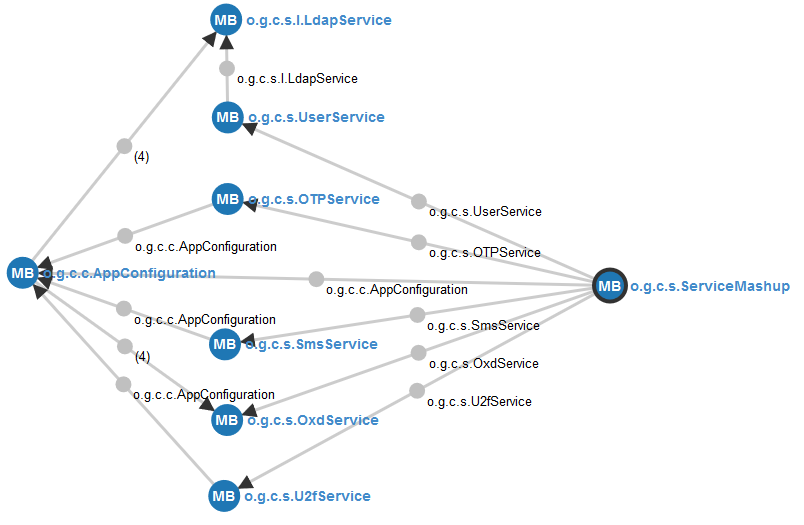

# Developer notes

## Projects' Java Packages Hierarchy

#### Top-level package

*org.gluu.credmanager*

#### User Interface packages

*ui.vm*: ZK's viewmodel POJOs (cred-manager uses the MVVM pattern, see [ZK documentation](https://www.zkoss.org/documentation) 

*ui.model*: Model classes (in MVVM pattern)

See also the [UI framework section](#ui-framework).

#### Core logic packages

*core* 

*core.init*: Initialization of web-app, sessions, etc 

*core.ortho*: cross-cutting tasks (e.g. logging & auditing): concerns which are orthogonal to the application, e.g. implemented as weld Interceptors 

*core.navigation*: Session management and page navigation 

*core.credential*: POJOs that represent different credential types

#### Services packages

Java classes that encapsulate important business logic and interactions with the outside (e.g. oxd, ldap, etc).

#### Configuration package

*conf*: Contains classes required to describe and store all kind of configurations used by the application.
	
#### Miscelaneous package

*misc*: Contains static methods that facilitate certain tasks such as collections handling or bean introspection.

### Notes

Normally, the following holds:

*ui* uses: *conf*, *core* 

*core* uses: *conf*, *service*, *misc*

Most important methods are already documented following the javadoc syntax.

## UI Framework

Given the project's requirements regarding to usability, mobile-friendliness, responsiveness, and so on, the [ZK Community Edition](https://www.zkoss.org) framework was chosen. Advantages to highlight from it: it's open source, widely adopted, and has plenty of documentation. Additionally, it shows a good compatibility level with the toolset already used by Gluu developers and have also deserved good reviews from authoritative sources.

Pages built with ZK are lightweight, still preserving a Java backend binding typical of JSF interfaces. The lifecycle of ZK pages and components is simpler than its counterpart (JSF) but still resembles many aspects of JSF such as interfaces defined in terms of XML tags and usage of EL expressions. So it's basically less overhead and complexity using similar dialects.

Depending on the approach taken (there are many), resulting interfaces may end up looking a lot like facelets. Nonetheless, **.zul** pages (file extension used in ZK) can include features similar to those found in JSP, JSTL, taglibs or even static approaches such as (X)HTML+CSS. If needed, scripting can also take place with a variety of languages such Groovy, Ruby, JavaScript and Python.

The following document is the recommended reading to be able to edit, change or add behavior to cred-manager's UI: *ZK MVVM reference*. This can be found in PDF format from ZK's website. It's important to understand the operation flow and concepts of the MVVM pattern before undertaking any task.

The following documents are of general reference for developers; they can be found also at ZK's website and are listed in order of relevance:

* ZK Developer Reference
* ZK ZUML Reference
* ZK Component Reference

In the maven's pom file of cred-manager, the version of the framework actually being used can be seen as well as dependencies stuff.

Despite ZK does a lot of Ajax without requiring developers to know about Javascript, this app includes some javascript files that enable the integration of existing javascript files of Gluu with the framework. Fortunately, they are fairly simple: see the files ending in *-util.js* at https://github.com/GluuFederation/cred-manager/tree/master/app/src/main/webapp/scripts

## Weld

Cred-manager uses weld for CDI. The single-jar approach (weld-servlet-shaded) was embraced for simplicity. In weld jargon this application is an implicit bean archive (see file `beans.xml` in WEB-INF folder). 

Most of POJOs in the package `org.gluu.credmanager.services` are managed beans and encapsulate a lot of business logic. To expose them to other application's classes a mashup of services was created as a session-scoped bean, see `org.gluu.credmanager.services.ServiceMashup` so most injections are there.

The following image from the `weld-probe` app shows the most important managed beans in cred-manager and their associated dependencies:

## Objects stored in user's session

ZK templates (.zul files) support bindings to managed bean properties through EL names as in JSF. Also, ViewModel classes (think of classic JSF backing-beans) are supposed to support normal dependency injection via the ZK's `@WireVariable` annotation, unfortunately, this does not hold for the Jetty server, thus, the ServiceMashup instance cannot be injected in ViewModel classes and was stored as a session attribute. See the class `org.gluu.credmanager.core.init.SessionListener` to learn more.

In addition, an instance of the class `org.gluu.credmanager.core.User` is stored in the session. All ViewModel classes use this object specially in conjunction with the `org.gluu.credmanager.services.UserService` bean to do most of credential management (CRUD).